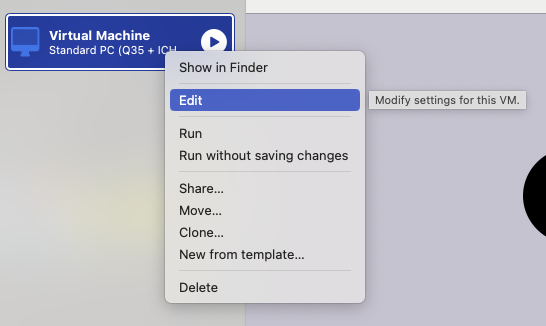

# Virtualbox-UTM
Method to convert .ova files to .qcow2 files that can be used with UTM on Apple Silicon chips.

## Requirements
```
brew install qemu
```

## Conversion
### Auto Conversion
```
wget https://raw.githubusercontent.com/nikon-63/Virtualbox-UTM/main/autoConversion.sh
```
Copy the autoConversion.sh file to the directory that contains the .ova file. 
*Note: Please ensure that the directory contains only one .ova file.* 

**Make file executable**
```
chmod +x autoConversion.sh
wget https://raw.githubusercontent.com/nikon-63/Virtualbox-UTM/main/autoConversion.sh
```

**Run script**
```
./autoConversion.sh
```

### Manual Conversion
__Extract .ova file__
```
tar -xvf <.ova File>
```

**Convert to .qcow2**
```
qemu-img convert -O qcow2 <Generated vmdk file> <qcow2 Output File>
```
## Importing
1. Create a new virtual machine and select emulate. 

2. Select “Other”.

3. Check “Skip ISO boot”.

4. Configure hardware settings.


5. Set up a shared directory if required. 

6. Select "Save".

7. Enter VM settings.\

8. Uncheck "UEFI Boot"

9. Create a new drive. Select "Import" and then select your .qcow2 file.
*Note: Make sure the "size" is set to the same as the .qcow2 file.* 

10. Move up the new IDE Drive to the top. \

11. Save and then Boot up your virtual machine 
